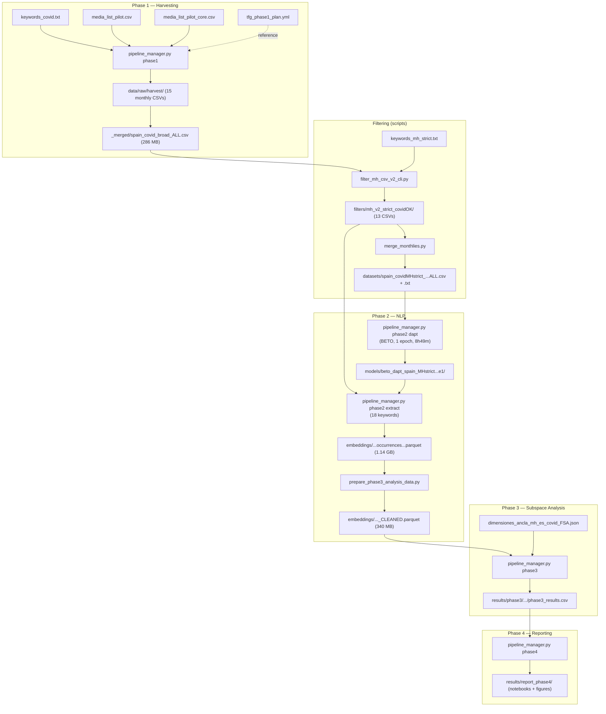

# TFG Project — Complete File Inventory & Version Map

> Full catalogue of every file used in the project, with version lineage and what was used at each pipeline step.
> Updated with details from [Pasos TFG Code.pdf](file:///c:/Users/alvar/Documents/PROGRAMMING/4th%20Year/TFG/Pasos%20TFG%20Code.pdf) progress notes.

---

## 1. Pipeline Overview — Which Files Feed Into Which Step



---

## 2. Configuration & Metadata Files

### 2.1 Keyword Lists

| File | Path | Purpose | Used in |
|---|---|---|---|
| `keywords_covid.txt` | `data/metadata/keywords/` | COVID/pandemic terms (9 terms in the file: *covid, coronavirus, pandemia, confinamiento, cuarentena, estado de alarma, toque de queda, vacunación*). **However, only 3 terms were actually passed to GDELT**: `covid coronavirus pandemia` | **Phase 1** — GDELT querying (only 3 of 9 terms used on CLI) |
| `keywords_mh.txt` | `data/metadata/keywords/` | Mental health broad list (14 terms: *salud mental, ansiedad, depresión, estrés, soledad, incertidumbre, fatiga, agotamiento, bienestar emocional, trastorno mental, psicólogo, terapia, suicidio, autolesión*). Too permissive — produced many false positives. | **Filtering v1** (early/discarded — too noisy) |
| `keywords_mh_strict.txt` | `data/metadata/keywords/` | Mental health **strict** list (18 terms, includes accent variants: *salud mental, ansiedad, depresion/depresión, estres/estrés, suicidio, psicologo/psicólogo, terapia, autolesion/autolesión, trastorno mental, psiquiatra, psiquiatria/psiquiatría, bienestar emocional, salud emocional*). Created to reduce noise from v1. | **Filtering v2** (final — `mh_v2_strict_covidOK`) |
| `keywords_socioeco.txt` | `data/metadata/keywords/` | Socioeconomic stressors (12 terms: *desempleo, paro, erte, despido, crisis económica, hipoteca, alquiler, pobreza, ayudas sociales, ansiedad económica*). Created for potential future robustness/sensitivity analysis without changing Phase 1 sampling. | **Planned** — not yet executed as a separate filter |
| `keywords_gdelt_en.txt` | `data/metadata/keywords/` | English equivalents (13 terms) | **Not used** — reserved for a potential English replication experiment |

> [!NOTE]
> **Phase 1 GDELT queries used only 3 keywords**: `covid`, `coronavirus`, `pandemia`. The broader `keywords_covid.txt` file was created for reference but the actual harvest commands always used just those 3. The `keywords_mh.txt/mh_strict.txt` were used in the **post-harvest filtering step**, not in GDELT queries.

### 2.2 Media Lists

| File | Path | Outlets | Used in |
|---|---|---|---|
| `media_list.csv` | `data/metadata/media_lists/` | 12 Spanish outlets (simple format: name, domain, type). Contains duplicates. Initial list created at project setup. | **Early reference** — superseded by pilot_core |
| `media_list_one.csv` | `data/metadata/media_lists/` | Single outlet: 20minutos.es | **Testing** — quick single-outlet test runs |
| `media_list_pilot.csv` | `data/metadata/media_lists/` | 4 outlets (eldiario, lavanguardia, europapress, elconfidencial). With RSS URLs. | **Phase 1 pilot only** — March 2020 initial test (JSONL output) |
| `media_list_pilot_core.csv` | `data/metadata/media_lists/` | **10 outlets** (elpais, elmundo, abc, eldiario, europapress, publico, lavanguardia, elconfidencial, elespanol, 20minutos). With `active` flag and `rss_url`. 20minutos set to `active=false` due to excessive Wayback Machine redirects causing slowdowns. | **Phase 1 production** — all monthly harvests (Apr 2020 – Mar 2021) |
| `media_list_template.csv` | project root | Template with Peruvian outlets (elcomercio.pe, larepublica.pe, etc.) | **Not used** — leftover from original LISBETH |

> [!IMPORTANT]
> **La Vanguardia** was toggled OFF during May–Jul 2020 to reduce errors/time and stabilise harvesting during initial scale-up, then re-activated from August 2020 (as a volume/coverage test) and kept ON for the rest of the project. **20minutos** was set to `active=false` from the start due to excessive Wayback Machine redirects. Both are documented in `runs/media_changes.log`.

### 2.3 Anchor Definitions (Phase 3)

| File | Dimensions | Version | Used in |
|---|---|---|---|
| `dimensiones_ancla.json` | 3 dims: *funcional, social, afectiva* | **Original (Yape/Peru)** — anchors about mobile wallets, payments, emotions about fintech | **Not used** — leftover from original LISBETH |
| `dimensiones_ancla_mh_es_covid.json` | 9 dims: *salud_mental_general, ansiedad_miedo_incertidumbre, depresion_anhedonia_desesperanza, suicidio_autolesion_crisis, duelo_perdida_trauma, suenio_insomnio_somatico, tratamiento_profesionales_recursos, trabajo_economia_estres, familia_violencia_aislamiento* | **v1** — high granularity, 9 fine-grained dimensions | **Phase 3 early experiments** (w3 run) |
| `dimensiones_ancla_mh_es_covid_FSA.json` | 3 dims: **Functional, Social, Affective** (FSA) | **v2 (FINAL)** — consolidated into 3 theoretically-grounded dimensions. Contains accented characters (UTF-8). | **Phase 3 FINAL runs** (w3_FINAL_CLEANED, V2_w7, V3_w7) |
| `dimensiones_ancla_mh_es_covid_FSA_ascii.json` | Same 3 dims (FSA) | **v2b** — ASCII-only version (accents stripped) to avoid tokenisation issues | **Fallback** — used when model tokeniser had issues with accented anchor sentences |

### 2.4 Pipeline Configuration

| File | Path | Content |
|---|---|---|
| `tfg_phase1_plan.yml` | `configs/` | Country: SP, Sources: [gdelt], Pilot window: 2020-03, Full window: 2019-01 to 2023-12 |
| `pyproject.toml` | project root | Project metadata, dependencies (torch, transformers, pandas, scikit-learn, etc.) |
| `requirements.txt` | project root | Pip requirements |
| `.gitignore` | project root | Excludes models/, large CSVs, Parquet files, experiment dirs |

---

## 3. Phase 1 — Harvesting (Raw Data)

**GDELT query**: `--keyword covid coronavirus pandemia` (3 terms only)
**Source**: GDELT, country SP (Spain)

The pipeline was executed month-by-month. March 2020 was special: it was done in weekly blocks during the pilot phase (using `media_list_pilot`, output as JSONL initially), then consolidated. From April 2020 onwards, each month was harvested in a single run using `media_list_pilot_core`.

### 3.1 Raw Harvest Output

**Path**: `data/raw/harvest/`

| File | Size | Period | Notes |
|---|---|---|---|
| `spain_covid_broad_2020-03-01_2020-03-08.csv` | 1.1 MB | Mar 1–8, 2020 | Pilot batch (weekly) |
| `spain_covid_broad_2020-03-09_2020-03-15.csv` | 5.0 MB | Mar 9–15, 2020 | Pilot batch (weekly) |
| `spain_covid_broad_2020-03-16_2020-03-31.csv` | 4.8 MB | Mar 16–31, 2020 | Pilot batch (2 weeks) |
| `spain_covid_broad_2020-04-01_2020-04-30.csv` | 44.7 MB | April 2020 | First production month (LV ON) |
| `spain_covid_broad_2020-05-01_2020-05-31.csv` | 34.8 MB | May 2020 | LV OFF |
| `spain_covid_broad_2020-06-01_2020-06-30.csv` | 23.3 MB | June 2020 | LV OFF |
| `spain_covid_broad_2020-07-01_2020-07-31.csv` | 21.9 MB | July 2020 | LV OFF (no summary metrics available) |
| `spain_covid_broad_2020-08-01_2020-08-31.csv` | 19.8 MB | August 2020 | LV re-activated (test) |
| `spain_covid_broad_2020-09-01_2020-09-30.csv` | 19.5 MB | September 2020 | LV ON |
| `spain_covid_broad_2020-10-01_2020-10-31.csv` | 10.7 MB | October 2020 | LV ON |
| `spain_covid_broad_2020-11-01_2020-11-30.csv` | 15.7 MB | November 2020 | LV ON |
| `spain_covid_broad_2020-12-01_2020-12-31.csv` | 20.8 MB | December 2020 | LV ON |
| `spain_covid_broad_2021-01-01_2021-01-31.csv` | 24.0 MB | January 2021 | LV ON |
| `spain_covid_broad_2021-02-01_2021-02-28.csv` | 18.8 MB | February 2021 | LV ON |
| `spain_covid_broad_2021-03-01_2021-03-31.csv` | 22.5 MB | March 2021 | LV ON |

**Total**: 15 CSV files covering **March 2020 – March 2021**.

### 3.2 Merged Corpus

| File | Path | Size |
|---|---|---|
| `spain_covid_broad_ALL.csv` | `data/raw/harvest/_merged/` | **286 MB** |
| `spain_covid_broad_ALL.txt` | `data/raw/harvest/_merged/` | **272 MB** (plain text version) |

> [!WARNING]
> These merged files are **NOT pushed to GitHub** (>100 MB). Backed up as ZIP in Google Drive.

### 3.3 Harvest Progress Log

Documented in `runs/corpus_progress_2020.md`:

| Month | Media list | LV on? | Candidates | Saved | MH matches | MH % |
|---|---|---|---|---|---|---|
| 2020-03 (pilot) | media_list_pilot | ON | — | 2,791 | 98 | 3.51% |
| 2020-04 | media_list_core | ON | 8,520 | 8,411 | 463 | 5.50% |
| 2020-05 | media_list_core | OFF | 6,017 | 5,935 | 261 | 4.40% |
| 2020-06 | media_list_core | OFF | 4,164 | 4,102 | 169 | 4.12% |
| 2020-07 | media_list_core | OFF | — | 3,802 | 131 | 3.45% |
| 2020-08 | media_list_core | ON | 3,836 | 3,735 | 141 | 3.78% |
| 2020-09 | media_list_core | ON | 3,919 | 3,841 | 148 | 3.85% |
| 2020-10 | media_list_core | ON | 2,311 | 2,263 | 73 | 3.23% |
| 2020-11 | media_list_core | ON | 3,008 | 2,922 | 115 | 3.94% |
| 2020-12 | media_list_core | ON | 3,583 | 3,506 | 126 | 3.59% |
| 2021-01 | media_list_core | ON | 4,701 | 4,519 | 149 | 3.30% |
| 2021-02 | media_list_core | ON | 3,524 | 3,414 | 119 | 3.49% |
| 2021-03 | media_list_core | ON | 4,240 | 4,132 | 164 | 3.97% |

---

## 4. Filtering Step (between Phase 1 and Phase 2)

Filtering was applied **after** harvesting to select only articles mentioning mental health terms within the COVID corpus. This went through multiple iterations.

### 4.1 Filter Script Evolution

From the progress notes (`Pasos TFG Code.pdf`):

| Script | Problem / Outcome | Status |
|---|---|---|
| `filter_mh.py` | ❌ Did not work — read data incorrectly (not parsing as CSV structure, treated lines as records) | Broken |
| `filter_mh_csv.py` | Worked but used `keywords_mh.txt` (14 broad terms) → too noisy, many false positives (articles mentioning "fatiga" or "soledad" without mental health context). No month selection. | ❌ Superseded |
| `filter_mh_csv_v2.py` | Used `keywords_mh_strict.txt` (18 strict terms) + COVID co-occurrence requirement. Fixed after folder reorganisation. No month CLI option. | ❌ Superseded |
| `filter_mh_csv_v2_cli.py` | ✅ Extension of v2 with `--month 2020-04` or `--year YYYY` CLI arguments. Used for all production filtering. | ✅ **FINAL** |

### 4.2 Filter Version Summary

| Version | Directory | Script | Keywords | COVID co-occurrence | Status |
|---|---|---|---|---|---|
| **mh_v1** | `data/interim/filters/mh_v1/` | `filter_mh_csv.py` | `keywords_mh.txt` (14 broad terms) | No | ❌ Discarded — too noisy, many false positives |
| **mh_v2_strict_covidOK** | `data/interim/filters/mh_v2_strict_covidOK/` | `filter_mh_csv_v2_cli.py` | `keywords_mh_strict.txt` (18 strict terms) | **Yes** — requires COVID keyword co-occurrence in same article | ✅ **FINAL** |

### 4.2 Filter v2 Output (Monthly Filtered CSVs)

**Path**: `data/interim/filters/mh_v2_strict_covidOK/`

13 monthly CSVs, one per month from March 2020 to March 2021:
- `spain_covid_MH_strict_covidOK_2020-03-01_2020-03-31.csv` (594 KB)
- `spain_covid_MH_strict_covidOK_2020-04-01_2020-04-30.csv` (3.1 MB) — largest month
- ... (one per month) ...
- `spain_covid_MH_strict_covidOK_2021-03-01_2021-03-31.csv` (1.1 MB)

### 4.3 Final Merged Dataset

| File | Path | Size | Description |
|---|---|---|---|
| `spain_covidMHstrict_2020-03_2021-03_ALL.csv` | `data/interim/datasets/` | **15.4 MB** | Final filtered corpus (CSV) |
| `spain_covidMHstrict_2020-03_2021-03_ALL.txt` | `data/interim/datasets/` | **14.8 MB** | Plain text version (used for DAPT) |

---

## 5. Phase 2 — NLP (Models & Embeddings)

### 5.1 Model Selection

> [!IMPORTANT]
> **RoBERTa-BNE (`PlanTL-GOB-ES/roberta-large-bne`) was deprecated and non-functional.** The project was forced to use only BETO (`dccuchile/bert-base-spanish-wwm-uncased`) as the base model.

### 5.2 DAPT — Failed Attempts & Final Model

From the progress notes, DAPT went through several failed/abandoned attempts before reaching the final configuration:

| Attempt | Corpus | Epochs | Outcome |
|---|---|---|---|
| 1. COVID Broad (full) | `spain_covid_broad_ALL.csv` (286 MB) | 3 | ❌ **KeyboardInterrupt** after 16 min — estimated 648 hours to complete (0.04% progress at 458/1,109,940 steps) |
| 2. COVID Broad (sample) | `spain_covid_broad_sample5000.csv` (5K articles sampled) | 1 | ❌ **Test/abandoned** — created for quick testing but not used for production |
| 3. MH-strict (final) | `spain_covidMHstrict_2020-03_2021-03_ALL.csv` (15.4 MB) | 1 | ✅ **SUCCESS** — completed in **8 hours 49 minutes** |

**Final DAPT Model**: `beto_dapt_spain_MHstrict_2020-03_2021-03_e1`

| Metric | Value |
|---|---|
| Base model | `dccuchile/bert-base-spanish-wwm-uncased` (BETO) |
| Corpus | MH-strict filtered dataset (15.4 MB) |
| Epochs | 1 |
| Training time | 8h 49m 00.75s |
| Train loss | 2.3675 |
| Train samples/sec | 2.265 |
| Train steps/sec | 0.566 |
| Total steps | 17,970 |
| Total FLOPs | 4,404,985 GF |
| Checkpoints | checkpoint-17500, checkpoint-17970 |
| Model weights | `model.safetensors` (419 MB) |

**Other model directories**:
| Directory | Status |
|---|---|
| `beto_dapt_spain_covid_2020-03_2021-03` | ❌ Empty — abandoned attempt #1 (COVID broad, interrupted) |
| `models/hf_home` | HuggingFace cache directory |

### 5.3 Embedding Extraction

The embedding extraction command used **18 specific keywords** passed on the CLI (not the keyword files):

```
--keywords "salud mental" "ansiedad" "depresion" "depresión" "estres" "estrés"
  "suicidio" "soledad" "miedo" "psicosis" "psicologo" "psicólogo"
  "terapia" "autolesion" "autolesión" "trastorno mental" "psiquiatria" "psiquiatría"
```

**Input**: The 13 monthly filtered CSVs from `data/interim/filters/mh_v2_strict_covidOK/` (NOT the merged ALL file)

| File | Path | Size | Description |
|---|---|---|---|
| `spain_covidMHstrict_occurrences_2020-03_2021-03.csv` | `data/interim/embeddings/` | **1.13 GB** | Raw occurrence embeddings (CSV) |
| `spain_covidMHstrict_occurrences_2020-03_2021-03.parquet` | `data/interim/embeddings/` | **1.14 GB** | Same data in Parquet format |
| `spain_covidMHstrict_occurrences_2020-03_2021-03_CLEANED.csv` | `data/interim/embeddings/` | **1.13 GB** | Cleaned version (CSV) — arrays parsed, nulls checked |
| `spain_covidMHstrict_occurrences_2020-03_2021-03_CLEANED.parquet` | `data/interim/embeddings/` | **340 MB** | ✅ **FINAL** — cleaned and compressed. Used as Phase 3 input. |

Each row contains 4 embedding vectors:
- `embedding_baseline_last4_concat` — BETO base, last 4 layers concatenated
- `embedding_baseline_penultimate` — BETO base, penultimate layer
- `embedding_dapt_last4_concat` — BETO DAPT, last 4 layers concatenated
- `embedding_dapt_penultimate` — BETO DAPT, penultimate layer

> [!WARNING]
> ALL embedding files are **NOT pushed to GitHub** (>100 MB). Backed up in Google Drive.

---

## 6. Phase 3 — Subspace Analysis (Results Versions)

### 6.1 Phase 3 Run History

**Run 1** — First attempt on raw (uncleaned) embeddings:
- Input: `...occurrences_2020-03_2021-03.parquet` (raw, not cleaned)
- Anchors: `dimensiones_ancla_mh_es_covid_FSA.json` (3 dims FSA)
- `--iters 200`, `--window-months 3`
- Started ~13:15, window 1 took ~4.5 hours (6 subspaces + 4 anchor sets per window)
- By 00:46 was on window 5 of 11
- Total estimated runtime: ~11 hours
- After this run, performed EDA on the embeddings dataset to verify integrity before proceeding
- Output: `mh_strict_covidOK_2020-03_2021-03_w3` → only artifacts, no final CSV

**Between Run 1 and Run 2** — EDA & Data Cleaning:
- Created `02_eda_embeddings_integrity.ipynb` — quality control: checked arrays, nulls, distributions
- Ran `prepare_phase3_analysis_data.py` to produce `_CLEANED.parquet`
- Once integrity verified, re-ran Phase 3

**Run 2 (FINAL)** — On cleaned embeddings:
- Input: `...occurrences_2020-03_2021-03_CLEANED.parquet`
- Anchors: `dimensiones_ancla_mh_es_covid_FSA.json` (3 dims FSA)
- `--iters 50` (reduced from 200), `--window-months 3`
- Errors encountered:
  1. Phase 3 initially required CSV input (not Parquet) — had to convert
  2. Anchor keyword accent mismatch — keyword in JSON didn't match tokenised sentence (tilde issues)
  3. **Window 5 — SVD convergence error** in `src/subspace_analysis/subspace.py` (KSelector bootstrap). The fast SVD driver (`gesdd`) failed to converge on certain bootstrap resamples. Fix: implemented a hybrid fallback mechanism — try fast `gesdd` first, if it throws `LinAlgError`, fallback to the slower but robust `gesvd` driver, and as a last resort, clean NaN/Inf values and retry. This is a lightweight approach: the fast path handles ~99% of cases, with the robust fallback only activating on difficult matrices (e.g., window 7).
  4. **Window 7 bug** — same SVD convergence issue but more persistent. Created `scripts/inspect_window7.py` to debug the specific matrix that caused failures.
- Output: `mh_strict_covidOK_2020-03_2021-03_w3_FINAL_CLEANED` → ✅ **has `phase3_results.csv`**

**Runs 3 & 4** — Window size experiments:
- `_V2_w7` and `_V3_w7` — tested 7-month windows, no final CSV produced

| Run directory | Anchors | Window | Iters | Input | Has results? | Status |
|---|---|---|---|---|---|---|
| `w3` | FSA (3 dims) | 3 mo | 200 | raw parquet | No | ❌ Early (pre-EDA) |
| `w3_FINAL_CLEANED` | FSA (3 dims) | 3 mo | 50 | **CLEANED** parquet | **Yes** (32 KB) | ✅ **FINAL** |
| `w3_V2_w7` | FSA (3 dims) | 7 mo | ? | CLEANED | No | ❌ Window experiment |
| `w3_V3_w7` | FSA (3 dims) | 7 mo | ? | CLEANED | No | ❌ Window experiment |

### 6.2 Phase 3 Analysis Conclusion

From the technique comparison (`comparativa_techniques.ipynb`):

> **Winner: DAPT + PENULTIMATE + CORRECTED**

This combination was selected as the best for the final results and visualisations.

All runs share the same artifacts structure:
```
artifacts/
├── anchors/
├── embeddings_anchors.csv  (10.7 MB)
├── manifests/
└── subspaces/
```

### 6.3 Top-Level Phase 3 Outputs

| File | Path | Size | Description |
|---|---|---|---|
| `phase3_results.parquet` | `data/` | 112 KB | Parquet copy of final results |
| `phase3_sim_matrix.csv` | `data/` | 2.4 KB | Similarity matrix between subspaces |

---

## 7. Phase 4 — Reports

### 7.1 Generated Reports

**Path**: `results/report_phase4/`

| File | Size | Description |
|---|---|---|
| `General_Report.ipynb` | 2.8 MB | Master report notebook |
| `phase4_4_1_metodologia_eda.ipynb` | 230 KB | Section 4.1 — Methodology EDA |
| `phase4_4_2_matematicas_eda.ipynb` | 551 KB | Section 4.2 — Mathematical framework EDA |
| `phase4_4_3_resultados_eda.ipynb` | 1.3 MB | Section 4.3 — Results EDA |
| `phase4_4_4_interpretacion_eda.ipynb` | 741 KB | Section 4.4 — Interpretation EDA |
| `phase4_figures/` | (directory) | Generated plots/figures |
| `phase4_tables/` | (directory) | Generated tables |
| `artifacts/` | (directory) | Supporting artifacts |

### 7.2 Methodological Report (Academic)

**Path**: `academic/methodological_report/`

| File | Description |
|---|---|
| `00_Executive_Summary.md` | Executive summary |
| `01_Data_Engineering.md` | Data engineering documentation |
| `02_NLP_Architecture.md` | NLP architecture documentation |
| `03_Mathematical_Framework.md` | Mathematical framework docs |
| `04_Results_Visual_Narrative.md` | Results visual narrative |
| `05_Sociological_Interpretation.md` | Sociological interpretation |
| `phase4_report.md` | Consolidated Phase 4 report |
| `phase4_appendix.md` | Appendix |
| `phase4_4_1_metodologia_eda.ipynb` | Methodology notebook (copy) |
| `phase4_4_2_matematicas_eda.ipynb` | Mathematics notebook (copy) |
| `phase4_4_3_resultados_eda.ipynb` | Results notebook (copy) |
| `phase4_4_4_interpretacion_eda.ipynb` | Interpretation notebook (copy) |

---

## 8. Analysis Notebooks

**Path**: `notebooks/`

> [!NOTE]
> Files marked **🔷 LISBETH** were auto-generated by the original LISBETH pipeline (referencing "Yape", Peruvian data, or `roberta-large-bne`). They were not used in the TFG analysis.

| Notebook | Size | Origin | Purpose |
|---|---|---|---|
| `02_eda_embeddings_integrity.ipynb` | 928 KB | ✅ **TFG** | Embedding integrity verification — quality control, array checks, nulls, distributions |
| `Final_Dataset_EDA.ipynb` | 650 KB | ✅ **TFG** | EDA of the final filtered MH-strict dataset |
| `all_data_check.ipynb` | 323 KB | ✅ **TFG** | Data integrity/completeness checks across all months |
| `Phase2_EDA.ipynb` | 541 KB | ✅ **TFG** | Phase 2 output exploration |
| `clean_csv_occurences_csv.ipynb` | 2.4 KB | ✅ **TFG** | CSV cleaning helper for embeddings |
| `comparativa_techniques.ipynb` | 3.7 MB | ✅ **TFG** ⭐ | Key notebook: comparison of layer strategies, raw vs corrected, baseline vs DAPT |
| `phase3_analysis_results.ipynb` | 395 KB | ✅ **TFG** | Phase 3 results exploration |
| `phase3_complete_analysis.ipynb` | 590 KB | ✅ **TFG** | Complete Phase 3 analysis (centroid plot, trajectory, drift) |
| `phase3_complete_executed.ipynb` | 684 KB | ✅ **TFG** | Same as above, with output cells executed |
| `Harvest_Report.ipynb` | 13 KB | 🔷 LISBETH | Compares "Old" vs "New" data from `data/yape_{YEAR}.csv` — not used |
| `phase2_eda_check.ipynb` | 11 KB | 🔷 LISBETH | Phase 2 data verification against generic schema — not used |
| `phase2_validation_report.ipynb` | 5.6 KB | 🔷 LISBETH | Checks `embeddings_baseline.parquet` / `anchors_baseline.parquet` — files don't exist in TFG |
| `phase3_analysis.ipynb` | 5.7 KB | 🔷 LISBETH | References `data/phase3_redesign` parquet — not used |
| `phase3_analysis_viewer.ipynb` | 6.1 KB | 🔷 LISBETH | Dashboard for Yape projections with Löwdin orthogonalisation — not used |
| `Phase4_Results_Report.html` | 280 KB | 🔷 LISBETH | HTML report about "Yape" with `roberta-large-bne` — not used |
| `Phase4_Results_Report_Fixed.ipynb` | 4.4 KB | 🔷 LISBETH | Fixed version of above — not used |

---

## 9. Utility & Diagnostic Scripts

**Path**: `scripts/`

> [!NOTE]
> Scripts marked **🔷 LISBETH** were auto-generated by the original LISBETH pipeline and reference Yape/Peru data or deprecated models. They were not used in the TFG.

| Script | Origin | Purpose | Used? |
|---|---|---|---|
| `filter_mh.py` | ✅ TFG | ❌ First filter attempt — broke because it didn't read data as CSV structure | ❌ Broken |
| `filter_mh_csv.py` | ✅ TFG | Filter v1 — worked but used broad keywords, too many false positives. Used for March pilot only. | ❌ Superseded |
| `filter_mh_csv_v2.py` | ✅ TFG | Filter v2 — strict keywords + COVID co-occurrence. No month CLI option. | ❌ Superseded |
| `filter_mh_csv_v2_cli.py` | ✅ TFG | ✅ **FINAL** — extension of v2 with `--month` / `--year` CLI args | ✅ Production |
| `filter_one_v2.py` | ✅ TFG | Filter single file (testing) | Testing only |
| `merge_monthlies.py` | ✅ TFG | Merge monthly filtered CSVs into `_ALL` dataset for DAPT | ✅ Used |
| `merge_data_updates.py` | ✅ TFG | Merge data updates/patches | One-off |
| `prepare_phase3_analysis_data.py` | ✅ TFG | Clean embeddings for Phase 3 input (parse arrays, check nulls) | ✅ Created `_CLEANED.parquet` |
| `export_results_csv.py` | ✅ TFG | Export Phase 3 results to CSV | ✅ Helper |
| `fix_anchors_ascii.py` | ✅ TFG | Strip accents from anchor JSON — fix tokeniser accent mismatch in Phase 3 | ✅ Created `_FSA_ascii.json` |
| `fix_cache.py` | ✅ TFG | Fix HuggingFace cache issues | One-off fix |
| `count_csv_rows.py` | ✅ TFG | Count rows in CSVs | Debugging |
| `inspect_row.py` | ✅ TFG | Inspect specific CSV rows | Debugging |
| `inspect_window7.py` | ✅ TFG | Debug Phase 3 window 7 SVD convergence bug | Debugging |
| `test_tokenizer.py` | ✅ TFG | Test tokeniser behavior | Testing |
| `check_resume_dates.py` | ✅ TFG | Check harvest resume points | Debugging |
| `compare_embedding_models_execution.py` | 🔷 LISBETH | Compare Spanish BNE vs XLM-R on Yape keywords — not used | ❌ Not used |
| `create_comparison_notebook.py` | 🔷 LISBETH | Generate `Reporte_Comparativo_Modelos.ipynb` for Yape — not used | ❌ Not used |

---

## 10. Source Code Modules

**Path**: `src/`

### 10.1 News Harvester (`src/news_harvester/`)

| File | Purpose |
|---|---|
| `__init__.py` | Package init |
| `__main__.py` | CLI entry point |
| `cli.py` | Harvest command-line interface (21 KB) |
| `config.py` | Settings/configuration |
| `domains.py` | Domain-specific CSS selectors for Spanish outlets |
| `models.py` | Data models for articles |
| `collectors/` | GDELT, Google News, RSS collectors |
| `processing/` | Text extraction and processing |
| `storage/` | CSV/output storage logic |

### 10.2 NLP (`src/nlp/`)

| File | Purpose |
|---|---|
| `dapt.py` | Domain-Adaptive Pretraining (MLM fine-tuning) |
| `extract.py` | Embedding extraction entry point |
| `model.py` | Model loading and embedding logic (7.4 KB) |
| `pipeline.py` | Full NLP pipeline orchestration (18.9 KB) |
| `build_anchors.py` | Anchor embedding generation |

### 10.3 Subspace Analysis (`src/subspace_analysis/`)

| File | Purpose |
|---|---|
| `__init__.py` | Package init |
| `pipeline.py` | Phase3Orchestrator — main pipeline (11 KB) |
| `pipeline_assembler.py` | Assembles pipeline steps (7.6 KB) |
| `schemas.py` | Phase3Config dataclass — all configuration (2.3 KB) |
| `data_loader.py` | Load embeddings/data |
| `windowing.py` | Sliding window logic (5.2 KB) |
| `subspace.py` | SVD subspace computation (11.9 KB) |
| `dimensionality.py` | Horn's parallel analysis for optimal dimensions (4.1 KB) |
| `anchors.py` | Anchor projection and alignment (11 KB) |
| `metrics.py` | Grassmannian distance, entropy, drift (8.9 KB) |
| `auditor.py` | Validation/audit logic (4.6 KB) |

### 10.4 Reporting (`src/reporting/`)

| File | Purpose |
|---|---|
| `__init__.py` | Phase4Orchestrator export |
| `orchestrator.py` | Report generation orchestration (10 KB) |
| `generator.py` | Notebook/HTML generation (5.7 KB) |
| `notebook.py` | Jupyter notebook construction (4.6 KB) |
| `assets.py` | Static assets for reports (7.9 KB) |

### 10.5 Visualization (`src/visualization/`)

| File | Purpose |
|---|---|
| `paper_plots.py` | Publication-quality plot generation (21.7 KB) |

### 10.6 Other

| File | Purpose |
|---|---|
| `src/cli.py` | Top-level CLI module (3.3 KB) |
| `src/data/` | Data handling utilities |
| `src/utils/extract_docx.py` | Extract text from DOCX files |

---

## 11. Run Logs & Diagnostics

### 11.1 Run Logs (`runs/`)

| File | Content |
|---|---|
| `corpus_progress_2020.md` | Monthly harvest statistics table |
| `media_changes.log` | La Vanguardia ON/OFF log |
| `method_notes.log` | Planned future analyses (socioeconomic filters) |
| `run_note_20260212_142513.txt` | GitHub + Google Drive backup notes |
| `2020-03_pilot_core.txt` | Pilot run configuration record |

### 11.2 Diagnostics

| File | Path | Content |
|---|---|---|
| `diag_media_test_dl_pilotcore_2020-03-14.csv` | `data/raw/diagnostics/` | Download diagnostics for pilot day |
| `pilot_spain_mediafiltered_2020-03-14.jsonl` | `data/raw/diagnostics/` | Raw JSONL pilot output |
| `diag_media_test_dl_pilotcore_2020-03-14_MH_strict_covidOK.csv` | `data/interim/diagnostics/` | MH filter diagnostics |
| `_bad_json_lines.log` | `data/interim/logs/` | Malformed JSON lines from harvest (7.5 MB) |

---

## 12. Academic / Reports (`academic/`)

| File | Size | Origin | Description |
|---|---|---|---|
| `INTRO_TFM.md` | 38 KB | 🔷 LISBETH | Full theoretical introduction (Yape / framing theory — from original Master's study). Not used in TFG. |
| `Reporte_Integral_TFM.ipynb` | 4.1 MB | 🔷 LISBETH | Comprehensive TFM report notebook (Yape analysis). Not used. |
| `Reporte_Integral_TFM (Actualizado).ipynb` | 4.6 MB | 🔷 LISBETH | Updated version of above. Not used. |
| `Reporte_Integral_TFM.html` | 3.6 MB | 🔷 LISBETH | HTML export. Not used. |
| `Reporte_Comparativo_Modelos.ipynb` | 1.2 MB | 🔷 LISBETH | Spanish BNE vs XLM-R comparison on Yape. Not used. |
| `Reporte_Comparativo_Modelos.html` | 1.4 MB | 🔷 LISBETH | HTML export. Not used. |
| `model_comparison/comparison_report.md` | 1 KB | 🔷 LISBETH | Model comparison summary (Yape). Not used. |
| `model_comparison/comparison_volume.png` | 327 KB | 🔷 LISBETH | Volume comparison chart (Yape). Not used. |

---

## 13. Version Summary — What Was Actually Used

> [!TIP]
> This is the "final configuration" — the exact versions of everything that produced the definitive results.

| Component | Final version used |
|---|---|
| **GDELT query keywords** | Only 3: `covid`, `coronavirus`, `pandemia` (passed on CLI, not from file) |
| **Media list** | `media_list_pilot_core.csv` (10 Spanish outlets; 20minutos=inactive, LV toggled) |
| **Filtering keywords** | `keywords_mh_strict.txt` (18 MH strict terms with accent variants) |
| **Filter script** | `filter_mh_csv_v2_cli.py` (strict + COVID co-occurrence) |
| **Filter output** | `mh_v2_strict_covidOK/` (13 monthly CSVs) |
| **Final dataset** | `spain_covidMHstrict_2020-03_2021-03_ALL.csv` (15.4 MB) |
| **DAPT corpus** | `spain_covidMHstrict_2020-03_2021-03_ALL.txt` (14.8 MB) |
| **Base model** | `dccuchile/bert-base-spanish-wwm-uncased` (BETO) — RoBERTa-BNE was deprecated |
| **DAPT model** | `beto_dapt_spain_MHstrict_2020-03_2021-03_e1` (1 epoch, 8h49m, loss=2.3675) |
| **Embedding keywords** | 18 terms passed on CLI (incl. accent variants + "psicosis", "miedo", "soledad") |
| **Embedding input** | 13 monthly filtered CSVs from `mh_v2_strict_covidOK/` |
| **Embeddings** | `spain_covidMHstrict_occurrences_..._CLEANED.parquet` (340 MB) |
| **Anchor definitions** | `dimensiones_ancla_mh_es_covid_FSA.json` (3 dims: Functional / Social / Affective) |
| **Phase 3 iterations** | 50 (reduced from initial 200 for time) |
| **Phase 3 results** | `mh_strict_covidOK_2020-03_2021-03_w3_FINAL_CLEANED/phase3_results.csv` |
| **Winning technique** | **DAPT + PENULTIMATE + CORRECTED** |
| **Window size** | 3 months (quarterly sliding windows) |
| **Time span** | March 2020 – March 2021 |

---

## 14. Chronological Development Narrative

Based on [Pasos TFG Code.pdf](file:///c:/Users/alvar/Documents/PROGRAMMING/4th%20Year/TFG/Pasos%20TFG%20Code.pdf):

1. **Setup** — Cloned LISBETH repo, installed deps, created `media_list.csv` (12 outlets), `keywords_mh.txt`, `keywords_covid.txt`, `tfg_phase1_plan.yml`
2. **Pilot Phase** — Tried MH keywords directly on GDELT → 0 results. Pivoted to COVID keywords (`covid coronavirus pandemia`) to harvest broadly, then filter for MH locally
3. **Pilot validation** — Single-day test (Mar 14, 2020) → 149 records. Then week test (Mar 9–15) → 1,271 records. 20minutos disabled (Wayback issues). Created `media_list_pilot.csv`
4. **Pilot month (March 2020)** — Harvested in 3 weekly blocks. Applied `filter_mh.py` → broke. Wrote `filter_mh_csv.py` → worked but too noisy. Created `keywords_mh_strict.txt`. Final March result: 98/2,791 = 3.51% MH
5. **Media onboarding** — Tested full outlet list, created `media_list_pilot_core.csv` (10 outlets). Disabled 20minutos, toggled La Vanguardia.
6. **Production harvesting** — Monthly harvest April 2020 – March 2021. Each month: harvest → filter with `filter_mh_csv_v2_cli.py` → store filtered CSV. MH rate oscillated 3.2–5.5%.
7. **Merge & DAPT** — Merged monthly filtered CSVs → `spain_covidMHstrict_...ALL.csv`. Tried DAPT on full 286 MB corpus → interrupted after 16 min (would take 648h). Reduced to MH-strict corpus, 1 epoch → completed in 8h49m.
8. **Embedding extraction** — Ran `phase2 extract` on 13 monthly filtered CSVs with 18 keywords → 1.14 GB parquet.
9. **EDA (should have been first)** — Created `02_eda_embeddings_integrity.ipynb`. Cleaned embeddings → `_CLEANED.parquet`.
10. **Phase 3 (first attempt)** — 200 iters, raw embeddings → ~11h run, no final CSV.
11. **Phase 3 (FINAL)** — 50 iters, cleaned embeddings. Fixed accent issues, window 5 & 7 bugs. Produced `phase3_results.csv`.
12. **Analysis** — `comparativa_techniques.ipynb` → conclusion: DAPT + PENULTIMATE + CORRECTED. Created analysis notebooks.
13. **Phase 4** — Generated report notebooks and figures.
